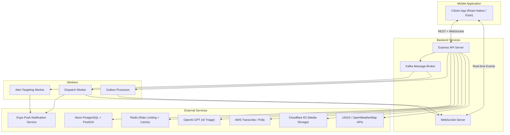
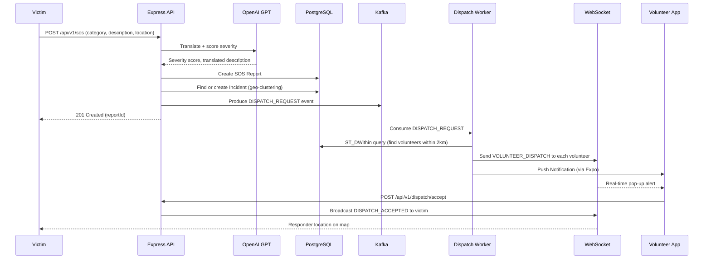
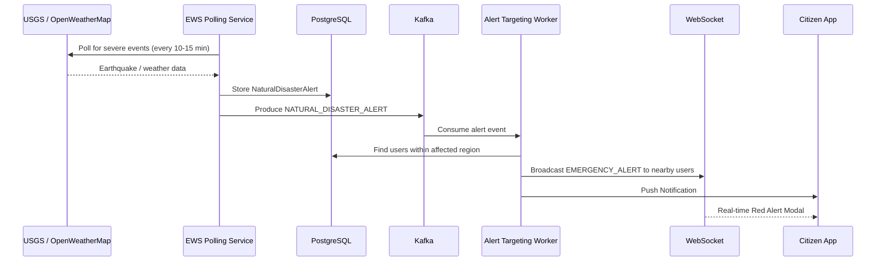
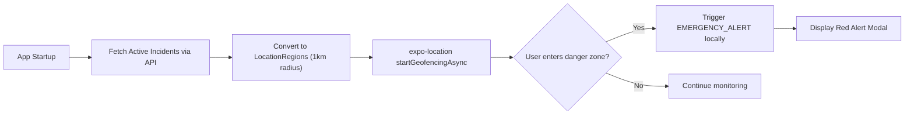
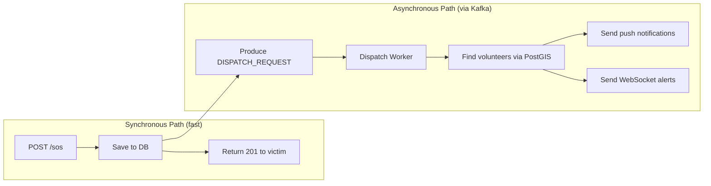
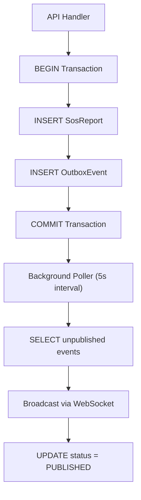
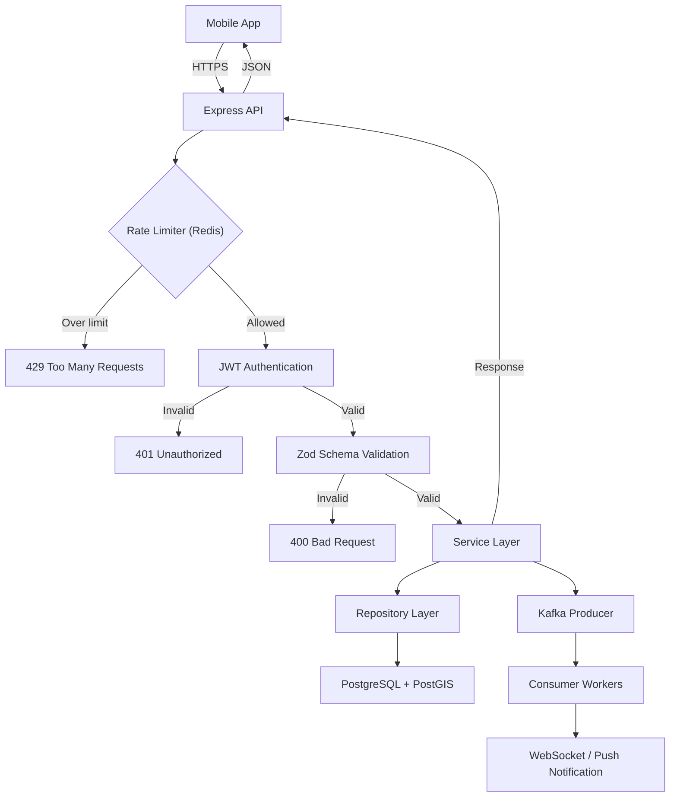
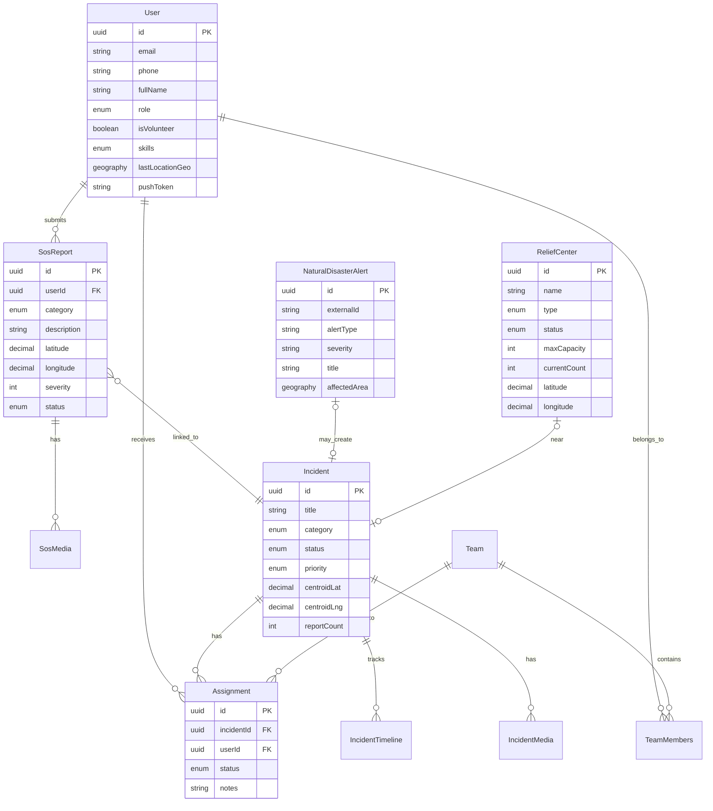
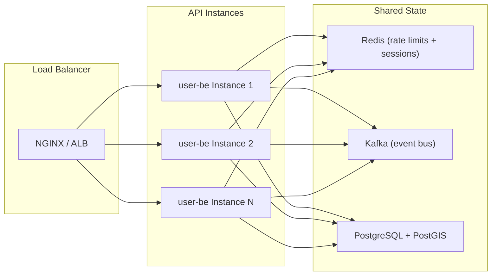

# RakshaSetu

**RakshaSetu** (meaning "Bridge of Protection" in Hindi) is a full-stack, real-time disaster management and citizen safety platform. It combines a React Native mobile application with a high-performance Node.js backend to provide end-to-end emergency response capabilities — from SOS reporting and AI-powered triage to volunteer dispatch and crowd-sourced danger mapping.

---

## Table of Contents

1. [Overview](#overview)
2. [System Architecture](#system-architecture)
3. [System Design Decisions](#system-design-decisions)
4. [Core Features](#core-features)
5. [Technology Stack](#technology-stack)
6. [Project Structure](#project-structure)
7. [Database Schema](#database-schema)
8. [API Reference](#api-reference)
9. [Real-Time Communication](#real-time-communication)
10. [Event-Driven Architecture](#event-driven-architecture)
11. [Scalability and Fault Tolerance](#scalability-and-fault-tolerance)
12. [Getting Started](#getting-started)
13. [Deployment](#deployment)
14. [Environment Variables](#environment-variables)

---

## Overview

RakshaSetu addresses the critical gap in disaster response by providing a unified platform that connects citizens in distress with nearby volunteers, first responders, and relief resources. The system is designed for high-availability scenarios where traditional communication infrastructure may be compromised.

### Key Capabilities

- Real-time SOS reporting with AI-driven severity scoring and multilingual translation
- Automated volunteer dispatch based on geospatial proximity
- Live incident tracking with geospatial clustering
- Early Warning System integrating USGS earthquake data and OpenWeatherMap severe weather alerts
- Geofence-based danger zone alerts for citizens approaching active incidents
- Offline-capable BLE mesh relay for SOS broadcast without internet
- AI-powered chatbot for emergency guidance and first aid instructions
- Voice-based SOS using AWS Transcribe and Polly for speech-to-text and text-to-speech

---

## System Architecture

### High-Level Architecture



### SOS-to-Dispatch Flow



### Early Warning System Flow



### Geofence Alerts Flow



---

## System Design Decisions

### Why Apache Kafka

Disaster management systems experience extreme traffic spikes. When an earthquake hits, thousands of SOS reports arrive simultaneously. A synchronous architecture would collapse under this load — the API server would block on volunteer search queries, push notification delivery, and alert targeting while the victim waits for a response.

Kafka solves this by decoupling the SOS submission from all downstream processing:



**Design rationale:**

- **Durability**: Kafka persists messages to disk. If the dispatch worker crashes mid-processing, the message is replayed from the committed offset on restart. No SOS is ever lost.
- **Backpressure handling**: During a mass-casualty event, the producer can write thousands of events per second. Consumers process them at their own pace without overwhelming the database.
- **Consumer group scaling**: Multiple dispatch worker instances can share the same consumer group. Kafka automatically partitions the load across them.
- **Topic isolation**: `DISPATCH_REQUEST` and `NATURAL_DISASTER_ALERT` are separate topics with independent consumers, so a slow alert pipeline never blocks volunteer dispatch.

The system uses KRaft mode (no Zookeeper dependency), reducing operational complexity from three processes to one.

### Why Redis

Redis serves two distinct roles in the architecture, each chosen for specific performance characteristics:

**1. Rate Limiting (Token Bucket via `rate-limit-redis`)**

During emergencies, the API faces both legitimate traffic spikes and potential abuse. Redis-backed rate limiting provides:

- **Distributed state**: If the backend scales to multiple instances behind a load balancer, all instances share the same rate limit counters through Redis. An in-memory store would reset on each instance, allowing clients to exceed limits by hitting different servers.
- **Atomic operations**: Redis `INCR` and `EXPIRE` are atomic, eliminating race conditions that would occur with database-backed counters.
- **Sub-millisecond latency**: Rate limit checks run on every API request. Redis responds in under 1ms, adding negligible overhead compared to the 50-200ms a PostgreSQL round trip would require.

**2. Caching Layer**

Frequently accessed data such as incident lists and user profiles are cached in Redis with TTL-based expiration, reducing database load during high-traffic periods:

```
Request → Check Redis Cache → Hit? → Return cached response
                             → Miss? → Query PostgreSQL → Store in Redis → Return
```

### Why PostgreSQL with PostGIS

The core operations of disaster management are inherently geospatial: finding nearby volunteers, clustering SOS reports into incidents, identifying users within an earthquake's radius, and locating relief centers. PostGIS extends PostgreSQL with spatial indexing and geographic functions that make these operations efficient:

**Volunteer proximity search:**
```sql
SELECT id FROM "User"
WHERE "isVolunteer" = true
  AND "lastLocationGeo" IS NOT NULL
  AND ST_DWithin(
    "lastLocationGeo",
    ST_SetSRID(ST_MakePoint(longitude, latitude), 4326)::geography,
    2000  -- 2km radius
  )
LIMIT 5;
```

This query uses a GiST spatial index to find volunteers within 2km in under 5ms, regardless of how many users exist in the system. A naive approach using the Haversine formula on raw latitude/longitude columns would require a full table scan.

**Incident clustering** uses similar spatial queries to group SOS reports within a configurable radius into unified incidents, preventing duplicate incident creation when multiple people report the same event.

**Why not a dedicated geospatial database (e.g., MongoDB with GeoJSON)?** PostgreSQL with PostGIS provides the same geospatial capabilities while maintaining ACID transactions, relational integrity, and compatibility with Prisma ORM. The application needs transactional guarantees (e.g., creating an SOS report and its outbox entry atomically) that document databases cannot reliably provide.

### Why WebSockets over Server-Sent Events or Polling

The application requires bidirectional real-time communication:

- **Server to client**: Dispatch alerts, EWS warnings, incident updates, responder location tracking
- **Client to server**: Volunteer location broadcasting during active dispatch

Server-Sent Events (SSE) only support server-to-client streaming. Long polling introduces latency and wastes bandwidth. WebSockets provide a persistent, low-latency, full-duplex channel that handles both directions over a single TCP connection.

The implementation maintains a map of authenticated user IDs to WebSocket connections, enabling targeted message delivery:

```
sendToUser(userId, { type: "VOLUNTEER_DISPATCH", payload: { ... } })
```

This allows the dispatch worker to send alerts only to specific volunteers rather than broadcasting to all connected clients.

### Design Patterns

#### Transactional Outbox Pattern



The outbox pattern guarantees that every database mutation produces a corresponding event, even if Kafka or WebSocket delivery temporarily fails. This eliminates the dual-write problem where a database write succeeds but the event publish fails, leaving the system in an inconsistent state.

#### Event-Driven Architecture with Consumer Workers

Instead of processing everything in the API request cycle, the system delegates expensive operations to dedicated Kafka consumer workers:

| Worker | Trigger | Responsibility |
|--------|---------|----------------|
| Dispatch Worker | `DISPATCH_REQUEST` topic | PostGIS volunteer search, push notification delivery, WebSocket dispatch |
| Alert Targeting Worker | `NATURAL_DISASTER_ALERT` topic | Find affected users by geography, send targeted alerts |
| Outbox Processor | Timer (5s polling) | Publish pending database events to WebSocket clients |

This separation ensures the API response time remains fast (under 500ms) regardless of how many downstream systems need to be notified.

#### Request Lifecycle



---

## Core Features

### 1. SOS Reporting and AI Triage

Citizens can report emergencies through a dedicated SOS screen supporting multiple categories: Flood, Fire, Earthquake, Accident, Medical, Violence, Landslide, Cyclone, and Other. Each report is processed through the following pipeline:

- **AI Translation**: Descriptions in any language are translated to English using OpenAI GPT
- **Severity Scoring**: AI assigns a 1-10 severity score to prioritize response
- **Incident Clustering**: Reports within geographic proximity are automatically grouped into unified incidents using PostGIS spatial queries
- **Media Attachments**: Users can attach images, video, and audio evidence stored on Cloudflare R2

### 2. Volunteer Dispatch System

The dispatch system connects victims with nearby qualified volunteers:

- **Volunteer Registration**: Users opt-in via a toggle in Settings, optionally declaring skills (CPR, Medical Doctor, Firefighter, Search and Rescue, etc.)
- **Proximity Search**: PostGIS `ST_DWithin` queries find active volunteers within a configurable radius (default 2km)
- **Dual Notification**: Volunteers receive both a push notification and a real-time WebSocket alert
- **Accept/Decline Flow**: Volunteers review the request and accept or decline; acceptance triggers real-time location sharing with the victim
- **Live Tracking**: The victim sees the volunteer's location updating on a map in real time

### 3. Early Warning System (EWS)

The platform continuously monitors external data sources for natural disasters:

- **USGS Earthquake Feed**: Polls the USGS API every 10 minutes for seismic events
- **OpenWeatherMap Severe Weather**: Polls every 15 minutes for storms, floods, and extreme weather
- **Targeted Alerts**: Only users within the affected geographic region receive alerts
- **Red Alert Modal**: A full-screen, high-urgency modal with disaster type, location, and severity

### 4. Geofence Danger Zone Alerts

The app sets up invisible geofences around active incidents:

- On app startup, all `OPEN` incidents are fetched from the backend
- Each incident becomes a 1km-radius geofence monitored by `expo-location`
- When a user physically enters a danger zone, a warning alert is triggered automatically
- Works in the background even when the app is not in the foreground

### 5. AI Emergency Chatbot

An integrated conversational AI assistant powered by OpenAI provides:

- Emergency guidance and first aid instructions
- Information about nearby relief centers and hospitals
- Voice input support via AWS Transcribe (speech-to-text)
- Voice response via AWS Polly (text-to-speech)

### 6. Real-Time Incident Map

The Explore tab provides a geospatial overview of the current situation:

- Active incidents displayed as color-coded markers by category
- Relief centers (shelters, hospitals, food centers) with real-time capacity
- Volunteer responder location tracking after dispatch acceptance
- Automated relief center discovery via integrated search APIs

### 7. Community and Social Features

- Community feed for sharing situation reports and mutual aid requests
- Upvote/downvote system for report credibility
- Real-time WebSocket updates for new incidents and status changes

### 8. BLE Mesh Relay (Offline SOS)

For scenarios with no internet connectivity:

- BLE (Bluetooth Low Energy) beacon broadcasting of SOS signals
- Passive mesh scanning detects nearby SOS beacons
- Relay mechanism propagates alerts through a chain of devices
- Enables emergency communication in network-dead zones

### 9. Voice-Based SOS

- Speech-to-text transcription using AWS Transcribe Streaming
- Text-to-speech responses using AWS Polly
- Enables hands-free emergency reporting for injured or visually impaired users

### 10. Offline Data Synchronization

- Local data bootstrapping for critical information
- WatermelonDB integration for offline-first data persistence
- Automatic sync when connectivity is restored

---

## Technology Stack

### Mobile Application

| Technology | Purpose |
|---|---|
| React Native (Expo SDK 54) | Cross-platform mobile framework |
| Expo Router | File-based navigation |
| React Native Maps | Geospatial visualization |
| expo-location | GPS, background tracking, geofencing |
| expo-notifications | Push notifications |
| expo-task-manager | Background task execution |
| expo-av | Audio recording and playback |
| react-native-ble-plx | BLE mesh relay |
| WatermelonDB | Offline-first database |

### Backend

| Technology | Purpose |
|---|---|
| Bun | JavaScript runtime |
| Express 5 | HTTP framework |
| Prisma 7 | ORM with PostgreSQL adapter |
| PostgreSQL + PostGIS | Relational database with geospatial extensions |
| Apache Kafka (KRaft) | Event streaming and async processing |
| Redis | Rate limiting and caching |
| WebSocket (ws) | Real-time bidirectional communication |
| Zod | Runtime schema validation |

### Cloud Services

| Service | Purpose |
|---|---|
| Neon | Managed PostgreSQL with PostGIS |
| RedisLabs | Managed Redis |
| Cloudflare R2 | Object storage for media uploads |
| AWS Transcribe | Speech-to-text |
| AWS Polly | Text-to-speech |
| OpenAI GPT | AI triage, translation, chatbot |
| Expo Push Service | Mobile push notifications |
| USGS API | Earthquake data |
| OpenWeatherMap | Severe weather alerts |

---

## Project Structure

```
RakshaSetu/
├── docker-compose.yml          # Kafka + Backend containerization
├── Dockerfile                  # Multi-stage Bun production build
├── prisma/
│   ├── schema.prisma           # Database schema (14 models)
│   ├── migrations/             # SQL migration history
│   └── generated/              # Generated Prisma client
├── prisma.config.ts            # Prisma configuration
├── packages/
│   ├── kafka/                  # Shared Kafka library
│   │   └── src/
│   │       ├── index.ts        # Producer, consumer, topic exports
│   │       ├── config.ts       # Kafka broker configuration
│   │       ├── producer.ts     # Message producer
│   │       ├── consumer.ts     # Consumer group runner
│   │       └── topics.ts       # Topic name constants
│   ├── user-be/                # Backend API server
│   │   └── src/
│   │       ├── index.ts        # Server entry point
│   │       ├── config/         # Environment configuration
│   │       ├── common/         # Shared middleware, DB clients
│   │       ├── routes/         # Express route definitions
│   │       ├── modules/
│   │       │   ├── auth/       # JWT authentication
│   │       │   ├── users/      # User profile management
│   │       │   ├── sos/        # SOS report submission
│   │       │   ├── incidents/  # Incident CRUD and clustering
│   │       │   ├── dispatch/   # Volunteer dispatch worker
│   │       │   ├── assignments/# Responder task assignments
│   │       │   ├── teams/      # Response team management
│   │       │   ├── alerts/     # EWS disaster ingestion
│   │       │   ├── chat/       # AI chatbot + voice
│   │       │   ├── relief-centers/ # Relief center management
│   │       │   ├── timeline/   # Incident timeline events
│   │       │   └── outbox/     # Transactional outbox pattern
│   │       └── ws/             # WebSocket server and handlers
│   └── citizen-app/            # React Native mobile app
│       ├── app/
│       │   ├── _layout.tsx     # Root layout (EWS + dispatch listeners)
│       │   ├── (tabs)/
│       │   │   ├── index.tsx       # Home (incident feed)
│       │   │   ├── sos.tsx         # SOS reporting screen
│       │   │   ├── explore.tsx     # Map with incidents + relief centers
│       │   │   ├── danger-zones.tsx# Live danger zone map
│       │   │   ├── community.tsx   # Social feed
│       │   │   ├── chatbot.tsx     # AI assistant
│       │   │   ├── my-reports.tsx  # User's SOS history
│       │   │   └── settings.tsx    # Profile + volunteer toggle
│       │   ├── dispatch-request.tsx # Volunteer accept/decline screen
│       │   └── incident/[id].tsx   # Incident detail view
│       ├── components/
│       │   └── alerts/
│       │       └── RedAlertModal.tsx # Full-screen EWS warning
│       └── services/
│           ├── api.ts              # REST API client
│           ├── socket.ts           # WebSocket client
│           ├── auth-store.ts       # Secure token storage
│           ├── location-background.ts # GPS + geofencing
│           └── ble-mesh/           # BLE offline relay
```

---

## Database Schema



---

## API Reference

### Authentication

| Method | Endpoint | Description |
|--------|----------|-------------|
| POST | `/api/v1/auth/signup` | Register a new citizen account |
| POST | `/api/v1/auth/login` | Authenticate and receive JWT |

### Users

| Method | Endpoint | Description |
|--------|----------|-------------|
| GET | `/api/v1/users/me` | Get current user profile |
| PATCH | `/api/v1/users/me` | Update profile, volunteer status, location |

### SOS Reports

| Method | Endpoint | Description |
|--------|----------|-------------|
| POST | `/api/v1/sos` | Submit an SOS report |
| GET | `/api/v1/sos/my` | List current user's reports |
| POST | `/api/v1/sos/:id/media` | Upload media attachment |

### Incidents

| Method | Endpoint | Description |
|--------|----------|-------------|
| GET | `/api/v1/incidents` | List incidents (paginated, filterable) |
| GET | `/api/v1/incidents/:id` | Get incident details |
| GET | `/api/v1/incidents/nearby` | Find incidents near a location |
| GET | `/api/v1/incidents/:id/media` | Get incident media |
| GET | `/api/v1/incidents/:id/timeline` | Get incident timeline |

### Assignments

| Method | Endpoint | Description |
|--------|----------|-------------|
| POST | `/api/v1/assignments` | Create responder assignment |
| GET | `/api/v1/assignments/my` | List user's assignments |
| PATCH | `/api/v1/assignments/:id/status` | Update assignment status |

### Teams

| Method | Endpoint | Description |
|--------|----------|-------------|
| POST | `/api/v1/teams` | Create a response team |
| GET | `/api/v1/teams` | List teams |
| POST | `/api/v1/teams/:id/members` | Add member to team |
| DELETE | `/api/v1/teams/:id/members/:userId` | Remove member |

### Relief Centers

| Method | Endpoint | Description |
|--------|----------|-------------|
| GET | `/api/v1/relief-centers/nearby` | Find nearby relief centers |
| GET | `/api/v1/relief-centers/:id` | Get relief center details |
| POST | `/api/v1/relief-centers/fetch-automated` | Discover centers via external APIs |

### AI Chat

| Method | Endpoint | Description |
|--------|----------|-------------|
| POST | `/api/v1/chat` | Send text message to AI assistant |
| POST | `/api/v1/chat/audio` | Send audio for voice-based interaction |

---

## Real-Time Communication

### WebSocket Events

The platform uses WebSocket connections for real-time bidirectional communication between the backend and mobile clients.

**Server to Client Events:**

| Event | Payload | Description |
|-------|---------|-------------|
| `incident:update` | `{ incidentId, status, category }` | Incident status change |
| `incident:new` | Incident object | New incident created |
| `EMERGENCY_ALERT` | `{ type, location, severity }` | EWS disaster warning |
| `NATURAL_DISASTER` | Alert payload | Natural disaster notification |
| `VOLUNTEER_DISPATCH` | `{ incidentId, category, lat, lng }` | Dispatch request to volunteer |
| `DISPATCH_ACCEPTED` | `{ responderId, lat, lng }` | Volunteer accepted dispatch |
| `location:update` | `{ lat, lng, speed, heading }` | Responder location update |
| `emergency:proximity` | `{ incidentId, message }` | Nearby emergency alert |
| `relief-center:update` | `{ id, status, currentCount }` | Relief center capacity change |
| `outbox:IncidentCreated` | Incident data | Outbox event broadcast |
| `outbox:NaturalDisasterAlert` | Alert data | Outbox disaster alert |

**Client to Server Events:**

| Event | Payload | Description |
|-------|---------|-------------|
| `location:update` | `{ lat, lng, speed, heading }` | User location broadcast |

---

## Event-Driven Architecture

### Kafka Topics

| Topic | Producer | Consumer | Purpose |
|-------|----------|----------|---------|
| `NATURAL_DISASTER_ALERT` | EWS Ingestion | Alert Targeting Worker | Route disaster alerts to affected users |
| `DISPATCH_REQUEST` | SOS Service | Dispatch Worker | Find and notify nearby volunteers |

### Transactional Outbox Pattern

The system implements the transactional outbox pattern to ensure reliable event delivery:

1. Database changes and outbox entries are written in the same transaction
2. A background poller reads unpublished outbox entries every 5 seconds
3. Events are broadcast via WebSocket and marked as published
4. This guarantees at-least-once delivery even if Kafka is temporarily unavailable

---

## Scalability and Fault Tolerance

### Horizontal Scaling Strategy



The architecture is designed for horizontal scaling at every layer:

| Component | Scaling Mechanism |
|-----------|-------------------|
| API Server | Add instances behind a load balancer; no shared in-process state |
| Kafka Consumers | Add instances to the same consumer group; Kafka redistributes partitions automatically |
| PostgreSQL | Neon provides read replicas and autoscaling compute; PostGIS indexes remain effective at scale |
| Redis | RedisLabs provides clustering and automatic sharding |
| WebSocket | Sticky sessions via load balancer; future option to use Redis pub/sub for cross-instance message routing |

### Graceful Degradation

The system is designed to remain functional when individual components fail:

| Failure | Impact | Mitigation |
|---------|--------|------------|
| Kafka unavailable | Async dispatch stops | Outbox pattern continues to capture events; they are replayed when Kafka recovers |
| Redis unavailable | Rate limiting falls back to in-memory | API continues serving requests; rate limits may be less accurate across instances |
| OpenAI API timeout | AI triage slows down | SOS reports are still saved with default severity; manual triage can proceed |
| Push notification failure | Volunteers miss push alerts | WebSocket dispatch provides a parallel notification channel |
| Internet connectivity loss | Mobile app goes offline | BLE mesh relay enables SOS broadcasting between nearby devices |

### Offline Resilience

The mobile application is designed with offline-first principles:

1. **BLE Mesh Relay**: When internet is unavailable, the app broadcasts SOS signals via Bluetooth Low Energy. Nearby devices with connectivity relay the signal to the backend.
2. **Local Data Bootstrap**: Critical reference data (relief center locations, emergency numbers) is cached locally on app startup.
3. **WatermelonDB**: Provides an offline-capable SQLite-based database that syncs with the backend when connectivity is restored.

### Capacity Planning

Estimated throughput for a single `t3.medium` EC2 instance (2 vCPU, 4GB RAM):

| Operation | Sustained Throughput |
|-----------|---------------------|
| API requests (REST) | ~500 requests/sec |
| WebSocket connections | ~5,000 concurrent |
| Kafka event production | ~10,000 events/sec |
| PostGIS spatial queries | ~2,000 queries/sec |

For a city-scale deployment (1 million users), the recommended configuration is 3 API instances, 2 Kafka consumer instances, and a managed PostgreSQL instance with 4 vCPU.

---

## Getting Started

### Prerequisites

- [Bun](https://bun.sh/) v1.0+
- [Docker](https://www.docker.com/) and Docker Compose
- [Node.js](https://nodejs.org/) v18+ (for Expo CLI)
- A Neon PostgreSQL database with PostGIS enabled
- A Redis instance (local or managed)

### 1. Clone the Repository

```bash
git clone https://github.com/your-username/RakshaSetu.git
cd RakshaSetu
```

### 2. Start Kafka

```bash
docker compose up kafka -d
```

### 3. Configure Environment Variables

```bash
cp packages/user-be/.env.example packages/user-be/.env
# Edit .env with your actual values (see Environment Variables section)
```

### 4. Install Dependencies and Generate Prisma Client

```bash
bun install
bunx prisma generate --config prisma.config.ts
bunx prisma migrate deploy --config prisma.config.ts
```

### 5. Start the Backend

```bash
cd packages/user-be
bun run src/index.ts
```

The API server will be available at `http://localhost:5001`.

### 6. Start the Mobile Application

```bash
cd packages/citizen-app
npm install
npx expo start --tunnel
```

Scan the QR code with the Expo Go app or a development build.

### 7. Build a Development APK (Recommended)

```bash
cd packages/citizen-app
npx eas build --platform android --profile development
```

---

## Deployment

### Docker Compose (Self-Hosted)

Deploy both Kafka and the backend as containers:

```bash
docker compose up --build -d
```

Verify the deployment:

```bash
curl http://localhost:5001/health
docker compose logs -f user-be
```

### AWS EC2

1. Launch an Ubuntu EC2 instance (t3.medium recommended)
2. Install Docker and Docker Compose
3. Clone the repository and configure environment variables
4. Run `docker compose up --build -d`
5. Configure security groups to expose port 5001

### Mobile App Distribution

- Development builds via EAS: `npx eas build --platform android --profile development`
- Production builds: `npx eas build --platform android --profile production`
- Internal distribution via EAS Update: `npx eas update`

---

## Environment Variables

| Variable | Description |
|----------|-------------|
| `NODE_ENV` | Runtime environment (`development` / `production`) |
| `USER_BE_PORT` | Backend server port (default: 5001) |
| `DATABASE_URL` | PostgreSQL connection string (with PostGIS) |
| `JWT_SECRET` | Secret key for JWT token signing |
| `JWT_EXPIRES_IN` | Token expiration duration (e.g., `7d`) |
| `REDIS_URL` | Redis connection string |
| `KAFKA_ENABLED` | Enable Kafka event streaming (`true` / `false`) |
| `KAFKA_BROKERS` | Kafka broker addresses |
| `R2_ENDPOINT` | Cloudflare R2 S3-compatible endpoint |
| `R2_ACCESS_KEY_ID` | R2 access key |
| `R2_SECRET_ACCESS_KEY` | R2 secret key |
| `R2_BUCKET_NAME` | R2 bucket name |
| `R2_PUBLIC_DOMAIN` | R2 public CDN domain |
| `OPENAI_API_KEY` | OpenAI API key for AI triage and chatbot |
| `EXPO_ACCESS_TOKEN` | Expo push notification access token |
| `AWS_ACCESS_KEY_ID` | AWS credentials for Transcribe/Polly |
| `AWS_SECRET_ACCESS_KEY` | AWS secret key |
| `AWS_REGION` | AWS region (e.g., `ap-south-1`) |
| `OPENWEATHER_API_KEY` | OpenWeatherMap API key |
| `TWILIO_ACCOUNT_SID` | Twilio account SID (SMS integration) |
| `TWILIO_AUTH_TOKEN` | Twilio auth token |

---

## License

This project is developed as part of an academic initiative. All rights reserved.
