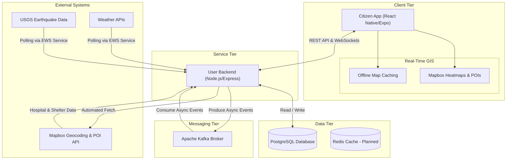

# RakshaSetu

RakshaSetu is a comprehensive disaster management and emergency response platform designed to bridge the communication gap between citizens, rescue teams, and relief centers during critical situations.

## Architecture Overview



## Overview

The project is structured as a monorepo utilizing Bun workspaces. It consists of multiple packages that work together to provide a robust, real-time, and resilient emergency system.

The core components include:
1. citizen-app: A React Native (Expo) mobile application for citizens to report incidents, send SOS signals, and communicate with rescue teams even in low-connectivity zones.
2. user-be: The main backend service built with Node.js and Express that handles user management, real-time communications, early warning systems, and incident tracking.
3. kafka: A shared event-streaming library facilitating communication between backend services.

## Key Features

- Real-time SOS & Emergency Beacons: Instantly alert nearby rescue teams and relief centers with your exact location.
- Incident Reporting: Empower citizens to report disasters, hazards, and infrastructure damage with multimedia support.
- Early Warning System (EWS) & Red Alerts: Automated ingestion of disaster data (e.g., USGS earthquakes) and severe weather alerts. Triggers highly visible **Red Alert Push Notifications** to instantly warn vulnerable populations proactively.
- Offline Mesh Communication Ready: Designed to work in limited connectivity environments utilizing outbox patterns and Bluetooth Low Energy (BLE) capabilities.
- Live Tracking & Timeline: Track rescue operations, team assignments, and the timeline of events up to resolution.
- AI-Powered Assistance: Integrated AI capabilities (via LangChain) to assist users during emergencies.

## Technology Stack

- Frontend: React Native, Expo, React Navigation, Maps (@rnmapbox/maps)
- Backend: Node.js, Express.js, TypeScript, WebSockets
- Database: PostgreSQL (via Prisma ORM)
- Message Broker: Apache Kafka (for event-driven data flows)
- Package Manager: Bun 

## Getting Started

### Prerequisites
- Bun (https://bun.sh/)
- Docker & Docker Compose (for Kafka & DB)
- Node.js (v18+)

### Installation
1. Clone the repository
2. Run `bun install` at the root directory to install all workspace dependencies.
3. Copy `.env.example` to `.env` and fill in the necessary environment variables.
4. Start the Kafka broker using Docker:
   ```bash
   docker-compose up -d
   ```
5. Run database migrations:
   ```bash
   bun run prisma:generate
   ```

To run individual packages, navigate to their respective directories in `packages/` and run their start scripts.

## Documentation
For a detailed breakdown of the backend architecture and its modules, please refer to the `microservices.md` file located at the root of the project.
