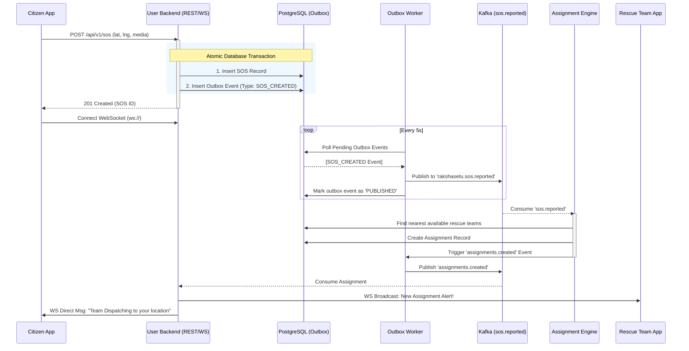
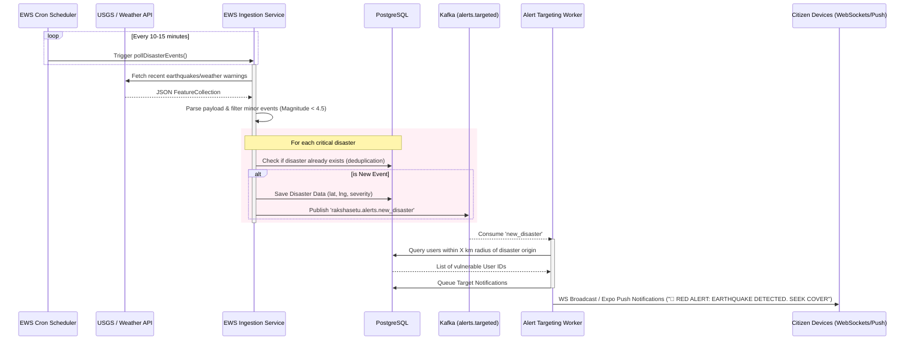
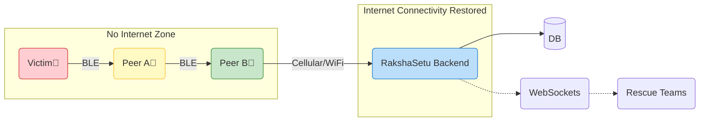

# RakshaSetu Architecture & Flow Diagrams

This document serves as a visual guide to understanding the functionality and data flow within the RakshaSetu platform. It contains High-Level Design (HLD) diagrams and specific Low-Level Design (LLD) workflows.

---

## 1. High-Level Design (HLD)
This diagram illustrates the macro-architecture of the entire system, showing how the frontend, backend, messaging queue, and external data sources interact.

```mermaid
graph TD
    %% Define styles
    classDef client fill:#e1f5fe,stroke:#039be5,stroke-width:2px;
    classDef backend fill:#fff3e0,stroke:#fb8c00,stroke-width:2px;
    classDef messaging fill:#f3e5f5,stroke:#8e24aa,stroke-width:2px;
    classDef database fill:#e8f5e9,stroke:#43a047,stroke-width:2px;
    classDef external fill:#eceff1,stroke:#546e7a,stroke-width:2px;

    %% Nodes
    subgraph Client Tier
        CitizenApp["Citizen App (Expo/React Native)"]:::client
        subgraph Real-Time GIS
            MapboxVis["Mapbox Heatmaps & POIs"]:::client
            OfflineMaps["Offline BLE & Caching"]:::client
        end
        CitizenApp --> MapboxVis
        CitizenApp --> OfflineMaps
    end

    subgraph "Service Tier (Node.js/Express)"
        UserBE[User Backend API]:::backend
        WSServer[WebSocket Server]:::backend
        OutboxWorker[Transactional Outbox Worker]:::backend
    end

    subgraph Messaging Tier
        Kafka{"Apache Kafka Broker"}:::messaging
    end

    subgraph Data Tier
        DB[("PostgreSQL Database")]:::database
        Redis[("Redis Cache - Planned")]:::database
    end

    subgraph External Systems
        USGS["USGS Earthquake Data API"]:::external
        WeatherDev[Weather Alert APIs]:::external
        MapboxAPI["Mapbox Geocoding POI API"]:::external
    end

    %% Connections
    CitizenApp <-->|REST API| UserBE
    CitizenApp <-->|ws:// Real-time Updates| WSServer
    
    UserBE <-->|Read / Write| DB
    WSServer <-->|Session State| Redis
    
    UserBE -->|Atomically Writes Events| DB
    DB -.->|Polled by| OutboxWorker
    OutboxWorker -->|Produces Events| Kafka
    Kafka -->|Consumes Async Tasks| UserBE
    
    %% External Ingestions
    USGS -->|Cron Polling (EWS)| UserBE
    WeatherDev -->|Cron Polling (EWS)| UserBE
    UserBE -->|Fetches Hospitals/Shelters| MapboxAPI
    MapboxAPI -->|POI Data| UserBE
```

---

## 2. SOS Alert Flow (Low-Level Design)
This flow details exactly what happens when a citizen presses the SOS button on their device, ensuring the alert is reliably delivered even during poor network conditions.



---

## 3. Early Warning System (EWS) Disaster Ingestion Flow
This flow explains how RakshaSetu acts proactively, pulling data from global agencies and warning citizens before or during an active disaster (like an earthquake).



---

## 4. Offline BLE Mesh Relay Flow
When cellular infrastructure is completely destroyed, the Citizen app relies on Bluetooth Low Energy (BLE) to pass SOS packets hopper-style to a device that has an active internet connection.


