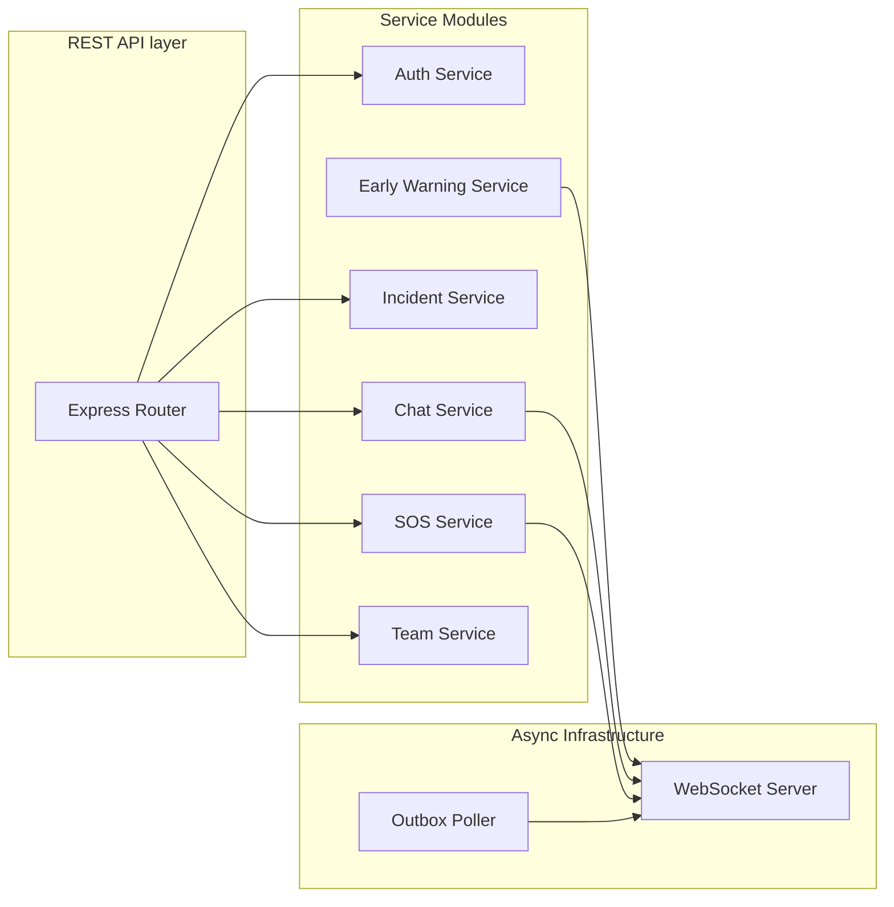

# RakshaSetu Microservices Architecture

The RakshaSetu platform is built using a modern, scalable architecture designed for high availability and resilience. These non-functional requirements are vital for an emergency response application.

This document outlines the core services, their specific routes, responsibilities, and the major features the API provides.

## 1. User Backend Service (`user-be`)
The `user-be` package is the primary Node.js/Express backend that serves the mobile application and handles the central business logic. It utilizes Prisma for database interactions and WebSockets for real-time data delivery.

### Internal Module Architecture

### API Endpoints & Features

- **Authentication (`/api/v1/auth`)**
  - Secure user onboarding, profile management, and JWT-based authentication mechanisms.

- **Users (`/api/v1/users`)**
  - Management of citizen and responder profiles, location updates, and preferences.

- **Chat & Communications (`/api/v1/chat`)**
  - Secure, real-time messaging between victims, rescue teams, and command centers.
  - Tightly coupled with WebSockets for instant, low-latency delivery.

- **SOS Management (`/api/v1/sos`)**
  - Processing and broadcasting emergency SOS beacons from users.
  - Tracking beacon status and rescue team response.
  - **BLE Relay Routes**: Handles offline SOS data ingested from Bluetooth mesh networks traversing via online peer devices.

- **Incidents & Heatmaps (`/api/v1/incidents`)**
  - Handling user-submitted reports of disasters, hazards, or infrastructural damage.
  - Aggregating incident data and providing GeoJSON-compatible coordinate mapping for Citizen App heatmaps, allowing real-time visualization of danger zones based on report density.

- **Rescue Teams (`/api/v1/teams`)**
  - Managing rescue teams, tracking their real-time location and availability.

- **Relief Centers & Medical POIs (`/api/v1/relief-centers`)**
  - Tracking the location, capacity, and resources of active relief camps and centers.
  - **Automated Mapbox Ingestion**: Using the `/fetch-automated` endpoint, the system connects to the Mapbox Geocoding POI API to automatically discover and map nearby hospitals, clinics, and community shelters based on the user's current coordinates.
  - Provides precise routing data for the frontend mapping interface.

- **Assignments (`/api/v1/assignments` & incident assign routes)**
  - Assigning rescue teams to specific SOS tasks or incidents based on proximity and severity.

- **Timeline (`/api/v1/timeline` & incident timeline routes)**
  - Maintaining an immutable timeline of events for tracking operational progression and conducting post-disaster analysis.

### Background Jobs
- **Outbox Pattern for Resilience**: Ensures no data is lost when connectivity drops. Messages and events are stored in a local outbox and processed reliably when the external connection stabilizes.
- **Alerts & EWS (Early Warning System)**: Automated ingestion from USGS and weather sources. Targets specific vulnerable populations using the Alert Targeting Worker.

### WebSocket Real-Time Layer (`/ws`)
RakshaSetu relies heavily on WebSockets to deliver critical updates instantly. The WebSocket server is integrated directly into `user-be`.

- **Authentication**: Clients connect by passing their JWT token in the query string (`ws://host/ws?token=xxx`).
- **Connection Management**: The server maps connections to User IDs and tracks connection health (`isAlive`) via ping/pong heartbeats every 30 seconds.
- **Role-Based Broadcasting**: 
  - `sendToUser`: Direct, private messages to a specific citizen or responder.
  - `broadcastToRole`: Sends data to all connected users of a specific role (e.g., broadcasting an SOS specifically to all online `responder` role clients).
  - `broadcast`: Global broadcasts for major disaster alerts (EWS).

## 2. Kafka Event Streaming (`kafka`)
The `kafka` package serves as the backbone for asynchronous communication between services.

### The Transactional Outbox Pattern
To prevent data loss and ensure atomicity, RakshaSetu implements the Transactional Outbox Pattern:
1. When `user-be` saves an entity (like an SOS Incident) to PostgreSQL, it atomically inserts a payload into a dedicated `outbox` table within the same database transaction.
2. A background worker continuously polls this `outbox` table.
3. The worker publishes the messages to Kafka topics, guaranteeing "At-Least-Once" delivery.

### Topics & Event Mapping
- `rakshasetu.incidents.created`: Core incident creation (When a new incident is logged or auto-created from SOS).
- `rakshasetu.incidents.updated`: Real-time updates (Status changes, priority shifts, new descriptions).
- `rakshasetu.assignments.created`: Dispatching (When a relief team is assigned to an incident).
- `rakshasetu.assignments.updated`: Progress tracking (When a team updates their assignment status).
- `rakshasetu.sos.reported`: Urgent Alerts (Direct feed of raw SOS reports, reserved for high-priority alerts).

### Features
- **Decoupled Architecture**: Allows the `user-be` to safely offload heavy tasks (like alert targeting or mass notification dispatch) without blocking the main event loop serving REST traffic.
- **Resiliency under Load**: In the event of backend request spikes during a sudden catastrophe, Kafka acts as a buffer.

## 3. Citizen Application (`citizen-app`)
The React Native (Expo) edge application connecting to the backend.

### Features
- **Offline-First Capabilities**: Uses localized caching and BLE integrations to form ad-hoc mesh networks when cellular infrastructure collapses.
- **Live Interactive Maps**: Integrates Mapbox to show real-time paths to safety, relief center locations, team positions, and danger zones.
- **AI Voice Bot (In Progress)**: Providing hands-free emergency assistance powered by natural language processing to reduce cognitive load during a crisis.
