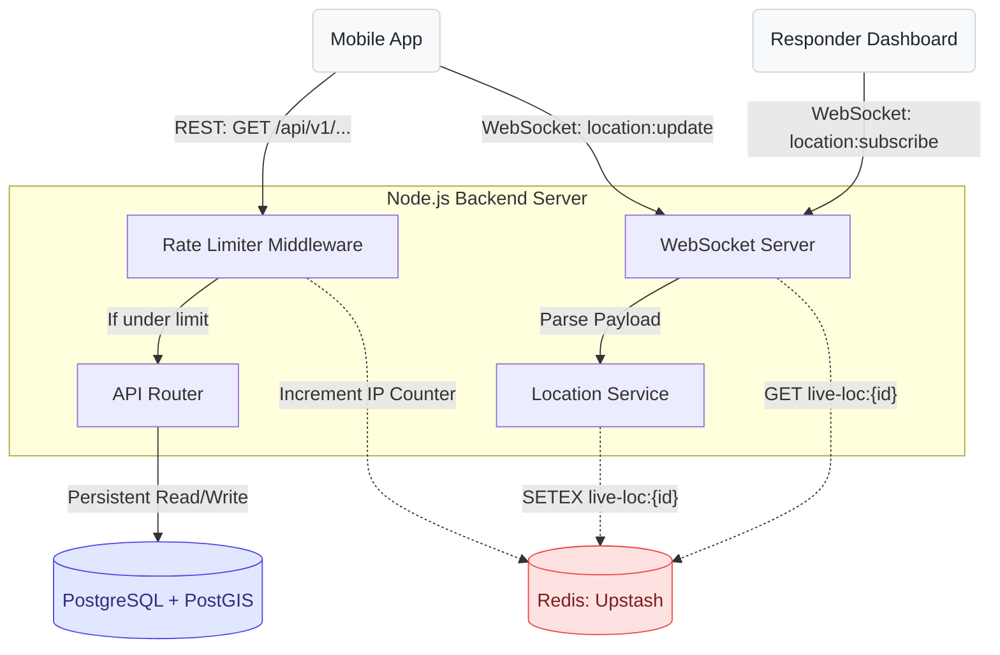

# RakshaSetu: Redis Architecture and Implementation Guide

This document serves as the formal technical specification for how Redis is integrated and utilized within the RakshaSetu backend architecture. It outlines the current implementations for rate limiting and real-time geospatial caching.

## 1. System Overview

RakshaSetu relies on an Upstash Managed Redis instance. While a traditional RDBMS (PostgreSQL) is used for persistent, relational data and complex geographical queries via PostGIS, Redis is deployed specifically for ephemeral, high-frequency, and shared-memory operations.

The backend Node.js server (running via Bun) connects to this single Redis instance, allowing it to act as a unified, ultra-fast memory layer for all horizontal backend instances.

## 2. Current Implementations

### 2.1 API Rate Limiting (Security)
The backend utilizes Redis to protect the external REST API routes from abuse and Denial-of-Service (DDoS) attacks.

*   **Implementation Location:** `src/index.ts`
*   **Mechanism:** The `express-rate-limit` package is configured with the `rate-limit-redis` store adapter.
*   **Behavior:** 
    *   Every incoming request to the `/api/` routing group triggers an increment operation in Redis for the requester's IP address.
    *   The window is set to 60,000 milliseconds (60 seconds) with a maximum threshold of 300 requests.
    *   If the limit is exceeded, the middleware intercepts the request and responds with a 429 status code before it reaches any application logic.
*   **Architectural Benefit:** Because the rate limits are stored in central Redis rather than in-memory on the Node server, the limits apply globally across all distributed backend containers.

### 2.2 Live Location Caching (Emergency Tracking)
The backend utilizes Redis to cache the latest GPS coordinates of users who are actively transmitting their location during an SOS event via WebSockets.

*   **Implementation Location:** `src/ws/location.service.ts` and `src/ws/index.ts`
*   **Mechanism:** 
    *   **Writing:** When a user's client emits a `location:update` WebSocket payload, the system invokes `setUserLatestLocation`. This executes a Redis `SETEX` (Set with Expiration) command. The key format is `live-loc:{userId}`.
    *   **Reading:** When an authorized Responder connects via an Emergency Dashboard and emits a `location:subscribe` payload targeting a specific user, the system invokes `getUserLatestLocation`. This executes a Redis `GET` command.
*   **Behavior:**
    *   The write payload contains a JSON stringified object of `{ latitude, longitude, heading, speed, updatedAt }`.
    *   The Time-To-Live (TTL) is strictly set to 300 seconds (5 minutes).
*   **Architectural Benefit:** 
    *   **Performance:** Writing high-frequency streaming data (e.g., every 2 seconds) to PostgreSQL would exhaust connection pools and Disk I/O. Redis absorbs these high-throughput writes entirely in memory.
    *   **Self-Cleaning:** The 300-second TTL guarantees that if a user's device loses power or connectivity, their stale location data is automatically purged without requiring background cleanup jobs.
    *   **Instant Sync:** Responders entering a tracking session mid-stream instantly receive the critical last-known location without having to wait for the client's next scheduled broadcast ping.

## 3. Architecture Diagram

The flowchart below visualizes the data flow between clients, the Node server, PostgreSQL, and Redis.

