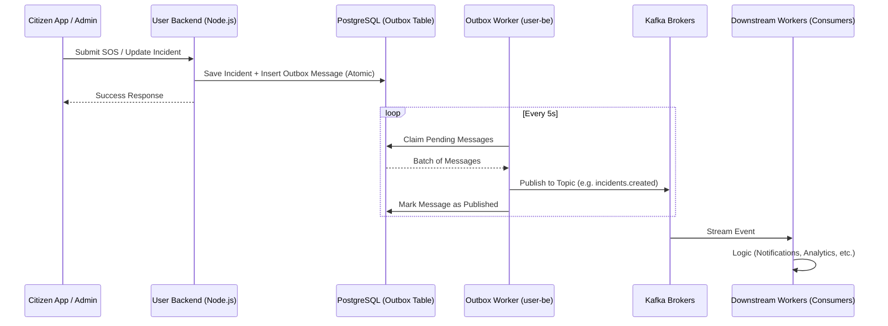
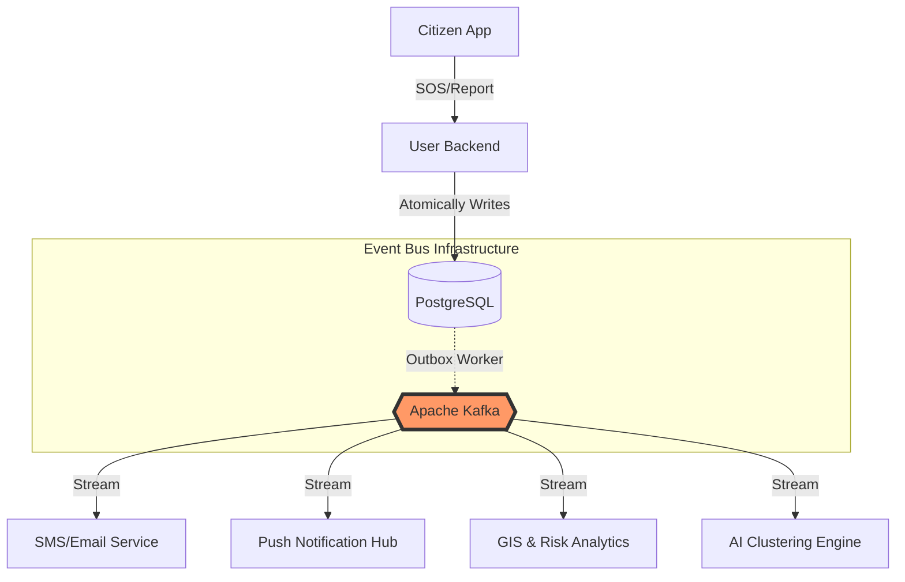
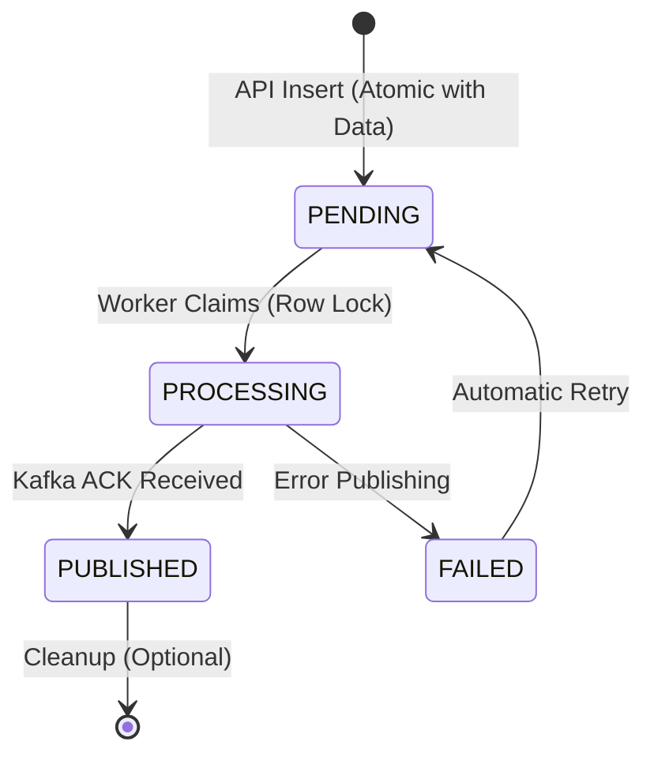
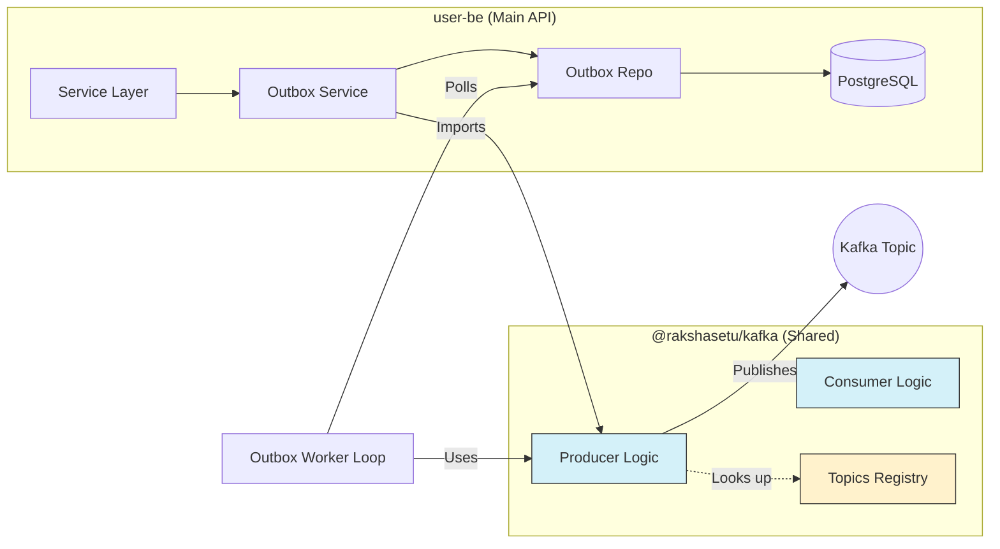

# 🚀 Kafka High-Level Design (HLD) - RakshaSetu

This document outlines the architecture, integration, and role of Apache Kafka within the RakshaSetu ecosystem.

## 🏗️ Architecture Overview

RakshaSetu uses Kafka as its **Event Bus** to ensure reliable, asynchronous communication between services. To prevent data loss and ensure atomicity, we implement the **Transactional Outbox Pattern**.

## 📖 How it Works (The Story)

Imagine a citizen reports an **SOS incident**. In a traditional system, the backend might try to save to the database and send a notification at the same time. If the notification service is down, the report is saved but the alert is lost. **RakshaSetu avoids this.**

1.  **The Transaction**: When you submit a report, the `user-be` saves the incident and a "message" into a special `outbox` table in the *same* database transaction. This is atomic—either both happen, or nothing happens.
2.  **The Courier (Outbox Worker)**: A background worker polls this `outbox` table every few seconds. It picks up pending messages and hands them over to **Kafka**.
3.  **The Broadcast**: Kafka takes the message and puts it into a **Topic** (like a specific radio frequency). It holds onto this message safely, even if no one is listening yet.
4.  **The Reaction**: Other services (like the SMS alerter or the AI Clustering engine) "listen" to these topics. When a new message arrives, they react immediately—sending a text to a responder or updating a dashboard—without ever slowing down the main Citizen App.

---

### The Flow of an Event



### 🛰️ System Topology

This diagram shows how Kafka acts as the central nervous system for RakshaSetu, allowing services to react to changes without direct coupling.



### 🔁 Outbox Message Lifecycle

We track every event through its lifecycle to ensure "At-Least-Once" delivery.



### 📊 Code Structure & Dependencies

This is how the internal pieces of your codebase are wired up:



---

## 🌟 Major Roles of Kafka

Kafka is not just a message queue; it's the backbone of our reactive architecture:

1.  **Decoupling Services**: The `user-be` doesn't need to know who is interested in an "Incident Created" event. It just publishes, and any service (SMS, Push Notifications, GIS Analytics) can subscribe.
2.  **Reliability (Outbox Pattern)**: By saving events to the database first, we ensure that if Kafka is down, events aren't lost. They stay in the `outbox` table and are retried until published.
3.  **Scalability**: Kafka allows multiple consumers to process the same stream of events at their own pace without slowing down the main API.
4.  **Data Consistency**: Using the `partitionKey` (usually `incidentId`), we ensure that events for the same entity are processed in the correct order.

---

## 📂 Topics & Event Mapping

Defined in `packages/kafka/src/topics.ts`:

| Topic Name | Purpose | Event Trigger |
| :--- | :--- | :--- |
| `rakshasetu.incidents.created` | Core incident creation | When a new incident is logged or auto-created from SOS. |
| `rakshasetu.incidents.updated` | Real-time updates | Status changes, priority shifts, or new descriptions. |
| `rakshasetu.assignments.created` | Dispatching | When a relief team is assigned to an incident. |
| `rakshasetu.assignments.updated` | Progress tracking | When a team updates their assignment status. |
| `rakshasetu.sos.reported` | Urgent Alerts | Direct feed of raw SOS reports (reserved for high-priority alerts). |

---

## 🛠️ How to Start

### 1. Local Infrastructure (Docker)
Ensure you have Kafka running. If you have a `docker-compose.yml` in the root:
```bash
docker-compose up -d kafka
```

### 2. Configuration
Kafka settings are managed via environment variables in your `.env` file within `packages/user-be`:
```env
KAFKA_ENABLED=true
KAFKA_BROKERS=localhost:9092
KAFKA_CLIENT_ID=rakshasetu-local
```

### 3. Initialize Topics
Run the helper script to create the necessary topics in your Kafka broker:
```bash
cd packages/kafka
bun run src/init-topics.ts
```

### 4. Running the Producer (User BE)
The producer starts automatically with the `user-be` server. Ensure the outbox worker is enabled in your server configuration.

### 5. Starting a Consumer
Use the shared `@rakshasetu/kafka` package to build consumers:
```ts
import { runConsumer, TOPICS } from "@rakshasetu/kafka";

await runConsumer("my-group-id", [TOPICS.INCIDENTS_CREATED], async ({ message }) => {
  console.log("New incident received:", message.value.toString());
});
```

---

## 🔍 Directory Structure
- `src/topics.ts`: Single source of truth for topic names.
- `src/producer.ts`: High-performance wrapper for `kafkajs` producer.
- `src/consumer.ts`: Utility for creating resilient consumers.
- `src/init-topics.ts`: Admin script for infrastructure setup.
